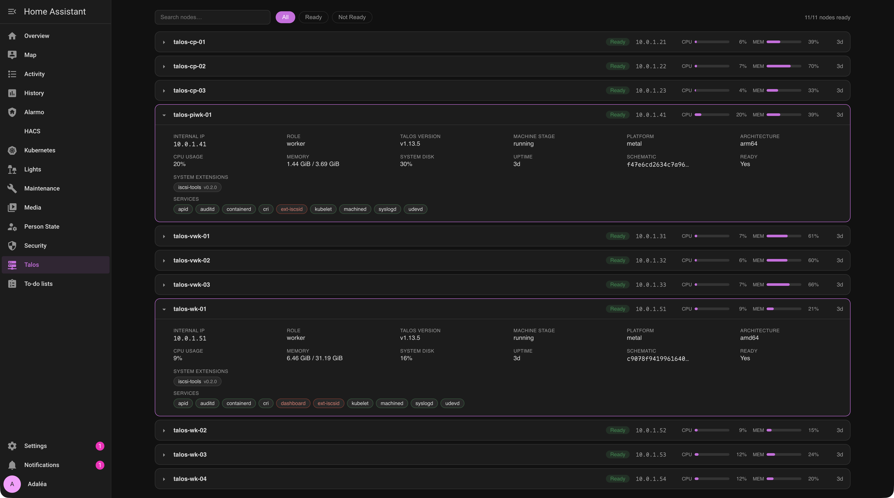

# Talos Linux for Home Assistant

[](https://github.com/hacs/integration)
[](https://github.com/fireball1725/talos-hass/actions/workflows/tests.yaml)
[](https://github.com/fireball1725/talos-hass/actions/workflows/hassfest.yaml)

[](https://my.home-assistant.io/redirect/hacs_repository/?owner=fireball1725&repository=talos-hass&category=integration)

A Home Assistant integration that surfaces Talos Linux cluster state: node OS versions, available upgrades, machine stage, system extensions, etcd health, and per-node metrics. It talks to the Talos API (`apid`) directly over mTLS, so it sees the Talos-native data that the generic `kubernetes` integration can't reach.



> **Status: pre-release (0.1.5), under active development.** Not yet published to the HACS default store. Expect breaking changes until 1.0.

## Why this exists

The existing [`kubernetes`](https://github.com/tibuntu/homeassistant-kubernetes) integration reads nodes through the Kubernetes API. From there a Talos node looks like any other node: a version string, a kubelet version, a ready condition. Talos keeps the rest behind its own gRPC API on port 50000: the running Talos version, the machine stage, installed system extensions, the Image Factory schematic ID, etcd member health, and per-node disk, CPU, and memory. This integration reads that API.

The headline feature is a per-node `update` entity that knows each node's schematic and builds the exact upgrade installer image, so an upgrade started from Home Assistant keeps that node's extensions instead of stripping them.

## Requirements

- A Talos Linux cluster reachable on `apid` port 50000.
- A `talosconfig` with at least the `os:reader` role. Write actions (reboot, upgrade, apply config, reset) need `os:operator` or `os:admin`.
- The Talos client is pure Python (`grpclib` over the stdlib `ssl` module), chosen because `grpcio`'s bundled BoringSSL can't negotiate the Ed25519 mTLS a Talos PKI uses by default. No architecture-specific wheels are needed for the client itself.

## Install (HACS custom repository)

Click the **Open in HACS** button above, or add it manually:

1. HACS → three-dot menu → Custom repositories.
2. Add `https://github.com/fireball1725/talos-hass` as an Integration.
3. Install **Talos Linux**, then restart Home Assistant.
4. Settings → Devices & Services → Add Integration → **Talos Linux**, or use this button:

[](https://my.home-assistant.io/redirect/config_flow_start/?domain=talos_linux)

## Configuration

The config flow asks for one control-plane endpoint and your `talosconfig`. `apid` proxies from that endpoint to every node, so node discovery is automatic. The flow detects the cert's role and tells you which write actions are available.

Options (set after setup):

- **Poll intervals** — node state (default 45s) and the upgrade-availability check (default hourly).
- **Upgrade target** — track the latest stable Talos release, or pin a target version that matches your upgrade plan.
- **Allow destructive operations** — off by default. Gates reboot, upgrade, and apply-config services.
- **Allow node reset/wipe** — a separate toggle, off by default. Gates the one service that destroys a node.

## Entities

One device per Talos node, plus a cluster device. Per node: Talos version, machine stage, CPU, memory, and disk usage, last boot, schematic ID, extension count, architecture, and platform, plus an `update` entity. Two binary sensors per node: reachable and ready. The cluster device carries node count, control-plane count, Talos version spread, the latest Talos release on offer, and a client-certificate expiry timestamp (the talosconfig cert that authenticates the integration; watch it so the credential doesn't lapse and lock you out). etcd members and per-service health show in the Talos panel rather than as entities.

## Services and safety

Write actions are gated three ways at once: the matching options toggle must be on, the cert role must allow it, and the call must pass a `confirm_node` field that string-matches the target node. A service whose tier is disabled is not registered at all.

**Single node only.** There is no orchestration in this integration. It will not cordon, drain, or sequence anything for you. Upgrading or rebooting more than one control-plane node at a time breaks etcd quorum. Ordering across nodes is your job, in your own automation.

## Development

Run the same checks CI runs:

```
pip install -r requirements_test.txt
ruff check custom_components/ tests/
ruff format --check custom_components/ tests/
mypy custom_components/talos_linux
pytest tests/
```

The gRPC stubs under `custom_components/talos_linux/proto/` are generated, not hand-edited. To regenerate them for a new Talos tag, run `scripts/generate_proto.sh`.

## Credits

Built by FireBall1725. Talos Linux is made by [Sidero Labs](https://www.siderolabs.com/).

## License

GNU Affero General Public License v3.0. Copyright © 2026 FireBall1725. See [LICENSE](LICENSE).
